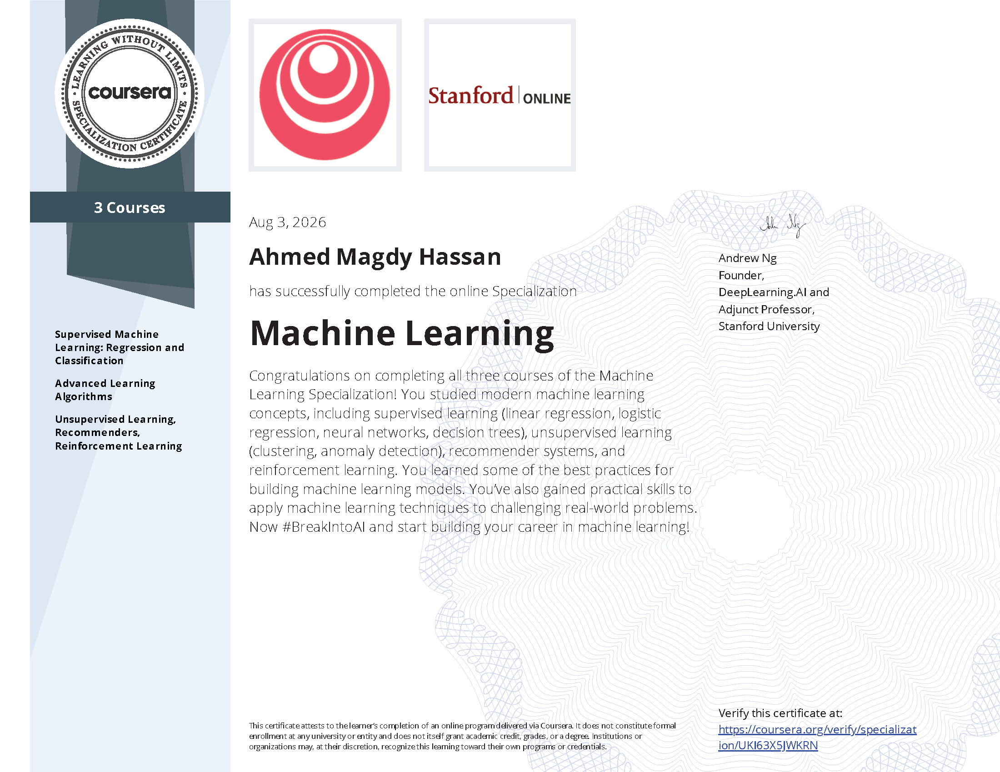

# Machine Learning Specialization

**Stanford University & DeepLearning.AI · Coursera**  
*Taught by Andrew Ng*

[](LICENSE)
[](https://www.python.org/)
[](https://jupyter.org/)
[](https://www.coursera.org/specializations/machine-learning-introduction)

<p align="center">
  
</p>

A complete collection of **optional labs**, **programming assignments**, **practice quizzes**, and **course materials** from the Machine Learning Specialization on Coursera.

> This repository contains my personal solutions and notes while completing the specialization. It is intended for educational reference only.

---

## Environment Setup & Installation

> **Why this section is at the top:**  
> While taking these courses I faced many environment and dependency issues (missing packages, version conflicts, broken notebooks, etc.). I had to figure everything out myself.  
> This repository is set up so you **don’t have to go through the same pain**. The environment has been fully configured and tested — all notebooks across the three courses run without errors when you follow the steps below.

> **Tested environment:** Python **3.12** + `requirements.txt`

### Recommended: Use the Interactive Setup Script

The easiest way to set everything up is to use the provided interactive script:

```bash
# 1. Clone the repository
git clone https://github.com/Sober-Migo/Coursera_Machine_Learning_Specialization.git
cd Coursera_Machine_Learning_Specialization

# 2. Run the setup script
python setup_env.py
```

The script will guide you step-by-step and let you choose:

- **venv** – Create a standard Python virtual environment (recommended for most users)
- **Conda** – Create a Conda environment with **Python 3.12** (recommended if you use Anaconda / Miniconda)
- Use the current Python environment (no isolation)
- Upgrade `pip`
- Install all packages from `requirements.txt`
- Verify that core packages work
- Optionally launch Jupyter Notebook when finished

It works on **Windows**, **macOS**, and **Linux**.

---

### Manual Installation (Alternative)

#### Option A – Using venv

```bash
git clone https://github.com/Sober-Migo/Coursera_Machine_Learning_Specialization.git
cd Coursera_Machine_Learning_Specialization

python -m venv venv

# Windows
venv\Scripts\activate

# macOS / Linux
source venv/bin/activate

pip install --upgrade pip
pip install -r requirements.txt

jupyter notebook
```

#### Option B – Using Conda

```bash
git clone https://github.com/Sober-Migo/Coursera_Machine_Learning_Specialization.git
cd Coursera_Machine_Learning_Specialization

conda create -n ml-specialization python=3.12 -y
conda activate ml-specialization

pip install --upgrade pip
pip install -r requirements.txt

jupyter notebook
```

The `requirements.txt` file contains the **complete set of packages** (with tested versions) needed to run every notebook in this repository without missing-dependency or version-conflict errors.

### Optional: Verify the environment

```bash
python -c "import numpy, pandas, sklearn, tensorflow, matplotlib; print('All core packages imported successfully!')"
```

---

## Table of Contents

- [Environment Setup & Installation](#environment-setup--installation)
- [About the Specialization](#about-the-specialization)
- [Repository Structure](#repository-structure)
- [Course Overview](#course-overview)
  - [Course 1 – Supervised Machine Learning](#course-1--supervised-machine-learning-regression-and-classification)
  - [Course 2 – Advanced Learning Algorithms](#course-2--advanced-learning-algorithms)
  - [Course 3 – Unsupervised Learning, Recommenders & RL](#course-3--unsupervised-learning-recommenders-reinforcement-learning)
- [Quiz Bank](#quiz-bank)
- [Certificate](#certificate)
- [Tech Stack](#tech-stack)
- [Disclaimer](#disclaimer)
- [License](#license)

---

## About the Specialization

The **Machine Learning Specialization** is a foundational online program created by **DeepLearning.AI** and **Stanford Online**. This beginner-friendly program teaches the fundamentals of machine learning and how to use these techniques to build real-world AI applications.

**What you will learn:**

- Build ML models with **NumPy** & **scikit-learn**
- Train supervised models for prediction and binary classification (linear & logistic regression)
- Build and train neural networks with **TensorFlow** for multi-class classification
- Apply decision trees and tree ensemble methods
- Implement unsupervised learning algorithms (clustering, anomaly detection)
- Build recommender systems (collaborative filtering & content-based)
- Train a deep reinforcement learning model

---

## Repository Structure

```text
Coursera_Machine_Learning_Specialization/
├── C01 - Supervised Machine Learning/
│   ├── week1/          # Optional Labs + Practice Quizzes
│   ├── week2/          # Optional Labs + Programming Assignment (Linear Regression)
│   └── week3/          # Optional Labs + Programming Assignment (Logistic Regression)
├── C02 - Advanced Learning Algorithms/
│   ├── week1/          # Neural Networks intuition & TensorFlow
│   ├── week2/          # Activation functions, Softmax, Multiclass
│   ├── week3/          # Model evaluation, bias/variance, ML development process
│   └── week4/          # Decision Trees & Tree Ensembles
├── C03 - Unsupervised Learning, Recommenders, Reinforcement Learning/
│   ├── week1/          # Clustering (K-means) & Anomaly Detection
│   ├── week2/          # Collaborative Filtering & Content-based Filtering
│   └── week3/          # Reinforcement Learning & Deep Q-Learning
├── Quiz Bank/          # Aggregated quiz PDFs for all three courses
├── MachineLearningCertificate.png
├── Machine Learning Specialization Certificate.pdf
├── requirements.txt
├── setup_env.py        # Interactive setup script (venv + Conda, Python 3.12)
└── README.md
```

---

## Course Overview

### Course 1 – Supervised Machine Learning: Regression and Classification

| Week | Topics | Materials |
|------|--------|-----------|
| **Week 1** | Supervised vs Unsupervised Learning, Model Representation, Cost Function, Gradient Descent | [Optional Labs](./C01%20-%20Supervised%20Machine%20Learning/week1/Optional%20Labs) · Practice Quizzes |
| **Week 2** | Multiple Linear Regression, Vectorization, Feature Scaling, Feature Engineering, Polynomial Regression, Scikit-learn | [Optional Labs](./C01%20-%20Supervised%20Machine%20Learning/week2/Optional%20Labs) · [Programming Assignment](./C01%20-%20Supervised%20Machine%20Learning/week2/C1W2A1) |
| **Week 3** | Classification, Logistic Regression, Decision Boundary, Regularization, Overfitting | [Optional Labs](./C01%20-%20Supervised%20Machine%20Learning/week3/Optional%20Labs) · [Programming Assignment](./C01%20-%20Supervised%20Machine%20Learning/week3/C1W3A1) |

**Key Skills:** Linear Regression · Logistic Regression · Gradient Descent · Regularization · Feature Engineering

---

### Course 2 – Advanced Learning Algorithms

| Week | Topics | Materials |
|------|--------|-----------|
| **Week 1** | Neural Networks Intuition, Neurons & Layers, TensorFlow Implementation | [Optional Labs](./C02%20-%20Advanced%20Learning%20Algorithms/week1/optional-labs) · [Programming Assignment](./C02%20-%20Advanced%20Learning%20Algorithms/week1/C2W1A1) |
| **Week 2** | Activation Functions (ReLU), Softmax, Multiclass Classification, Backpropagation | [Optional Labs](./C02%20-%20Advanced%20Learning%20Algorithms/week2/optional-labs) · [Programming Assignment](./C02%20-%20Advanced%20Learning%20Algorithms/week2/C2W2A1) |
| **Week 3** | Model Evaluation & Selection, Bias vs Variance, ML Development Process | [Optional Labs](./C02%20-%20Advanced%20Learning%20Algorithms/week3/optional-labs) · [Programming Assignment](./C02%20-%20Advanced%20Learning%20Algorithms/week3/C2W3A1) |
| **Week 4** | Decision Trees, Tree Ensembles (Random Forests, XGBoost) | [Optional Labs](./C02%20-%20Advanced%20Learning%20Algorithms/week4/optional%20labs) · [Programming Assignment](./C02%20-%20Advanced%20Learning%20Algorithms/week4/C2W4A1) |

**Key Skills:** Neural Networks · TensorFlow · Softmax · Decision Trees · Ensemble Methods · Model Diagnosis

---

### Course 3 – Unsupervised Learning, Recommenders, Reinforcement Learning

| Week | Topics | Materials |
|------|--------|-----------|
| **Week 1** | K-means Clustering, Anomaly Detection | [Programming Assignments](./C03%20-%20Unsupervised%20Learning%2C%20Recommenders%2C%20Reinforcement%20Learning/week1/C3W1A) |
| **Week 2** | Collaborative Filtering, Content-based Filtering, Recommender Systems | [Programming Assignments](./C03%20-%20Unsupervised%20Learning%2C%20Recommenders%2C%20Reinforcement%20Learning/week2/C3W2) |
| **Week 3** | Reinforcement Learning, State-Action Value Function, Deep Q-Learning | [Optional Labs](./C03%20-%20Unsupervised%20Learning%2C%20Recommenders%2C%20Reinforcement%20Learning/week3/optional-labs) · [Programming Assignment](./C03%20-%20Unsupervised%20Learning%2C%20Recommenders%2C%20Reinforcement%20Learning/week3/C3W3A1) |

**Key Skills:** Clustering · Anomaly Detection · Recommender Systems · Reinforcement Learning · Deep Q-Networks

---

## Quiz Bank

Aggregated practice quizzes for quick review:

| Course | File |
|--------|------|
| Course 1 | [Course 1 Quiz.pdf](./Quiz%20Bank/Course%201%20Quiz.pdf) |
| Course 2 | [Course 2 Quiz.pdf](./Quiz%20Bank/Course%202%20Quiz.pdf) |
| Course 3 | [Course 3 Quiz.pdf](./Quiz%20Bank/Course%203%20Quiz.pdf) |

---

## Certificate

<p align="center">
  
</p>

You can also view the original PDF certificate:

**[Machine Learning Specialization Certificate.pdf](./Machine%20Learning%20Specialization%20Certificate.pdf)**

---

## Tech Stack

| Category | Libraries / Tools |
|----------|-------------------|
| Core | Python 3.12, NumPy, Pandas |
| Machine Learning | scikit-learn, TensorFlow |
| Visualization | Matplotlib, Seaborn |
| Environment | Jupyter Notebook / JupyterLab |
| Others | See `requirements.txt` for the full list |

---

## Disclaimer

This repository is created for **personal learning and educational purposes only**.

- The materials belong to **Stanford University**, **DeepLearning.AI**, and **Coursera**.
- Solutions are shared to help fellow learners understand concepts, **not** to encourage academic dishonesty.
- Please attempt the assignments yourself first before referring to any solutions.
- Always respect Coursera’s Honor Code.

---

## License

This project is licensed under the **MIT License** – see the [LICENSE](LICENSE) file for details.

---

### Useful Links

- [Machine Learning Specialization on Coursera](https://www.coursera.org/specializations/machine-learning-introduction)
- [DeepLearning.AI](https://www.deeplearning.ai/)
- [Andrew Ng](https://www.andrewng.org/)

---

⭐ If you find this repository helpful, consider giving it a star!
